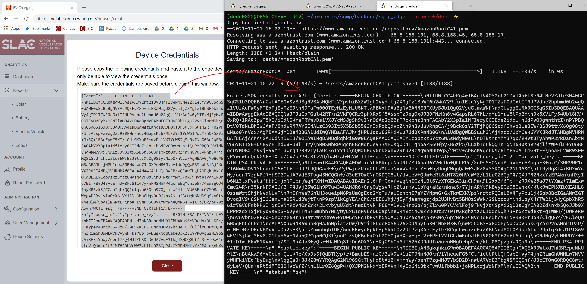

# Operating Playbook

This playbook documents various procedures for the operator of SGMP platform.

## Creating an account

In web frontend, click User Management -> Users -> Create.
- Email: The login email of the user. The initial password will be sent to this address.
- Name: Name of the user.
- Role: Assign a role for the user.
- House: Assign a house for the user.

After clicking Create, the user will be created and an email including the initial password will be sent to the address.

## Creating a house

In web frontend, click House Settings -> Create.
- House Name: Name of the house. Must be globally unique.
- Description: A text description of the house. Can be updated in the future.

After clicking Create, the house will be created and a set of AWS IoT Core credentials will be generated and displayed to the user.
The credentials is NOT stored in the backend server, thus the user must take note of the credentials at the time of creation.

To install the software on Raspberry Pi, first copy the directory `backend/sgmp_edge` to the Raspberry Pi. On the RPi, run
```
# Install Python virtualenv
sudo apt-get update
sudo apt-get install python3-virtualenv

# Create and switch to virtual environment
python3 -m virtualenv ~/sgmp_venv -p python3
source ~/sgmp_venv/bin/activate

# Install required packages
cd ~/sgmp_edge
pip install -r requirements.txt

# Install the credentials
python install_certs.py
<paste the result from previous step>
```



Update the config of the edge program. Copy `config_example.py` to `config.py` and set `house_id` to the correct House ID.

Now you should be able to run the edge device program by using
```
python Main_Publisher.py
```

## Creating a device

First make sure the desired house is selected. In web frontend, click Configuration -> Device -> Create.
- Device Name: Name of the device. Must start with alphabet and only contain alphabet, number and underscore, otherwise it can not be used in a formula. Must be unique in each house.
- Description: Text description of the device. Can be upated later.
- Type: Type of the device. Currently supported are `sonnen`, `egauge`, `powerflex`.
- Config: JSON config of the device. Please see the section below for example config formats.

After clicking Create, the API will validate the input and proceed with the creation. Once the device is created you can synchronize the configuration by clicking House Settings -> Choose the house -> Synchronize Configuration.

## Device config examples

### sonnen
```
{
  "ip": "198.129.119.220",
  "serial": "12345",
  "token": "0123456701234567012345670123456701234567012345670123456701234567"
}
```
- ip: Local IP of the device.
- serial: Serial number of the device, for remote API usage.
- token: Remote API authorization token.

### egauge
```
{
  "ip": "198.129.116.113",
  "keys": [
    "A.Battery",
    "A.SubPanel",
    "A.GridPower",
    "A.Solar",
    "A.EV",
    "A.L1_Voltage",
    "A.L2_Voltage",
    "A.L1_Frequency",
    "A.L2_Frequency",
    "A.Load",
    "ts"
  ]
}
```
- ip: Local IP of the device.
- keys: Keys to retrieve data. Can be eGauge register names.

### powerflex
```
{
  "acc_id": "03",
  "acs_id": "02",
  "password": "mysuperstrongpassword",
  "url": "https://slac.powerflex.com:9443",
  "username": "user@domain.name"
}
```
- acc_id: PowerFlex internal ID that represents a parking garage or building.
- acs_id: PowerFlex internal ID taht represents a charging station.
- password: Password of PowerFlex API.
- url: Endpoint of PowerFlex API.
- username: Username of PowerFlex API.

## Creating an analytics item

First make sure the desired house is selected. In web frontend, click Configuration -> Analytic Items -> Create.
- Analytics Name: Name of the analytic item. Must start with alphabet and only contain alphabet, number and underscore, otherwise it can not be used in a formula. Must be unique in each house.
- Description: Text description of the analytic item. Can be upated later.
- Formula: Expression of the analytic item. See below for specifications.
- Continuous Aggregation: If enabled, continuous aggregation will be created in each identifier present in the formula. Initial data population will take a few minutes if there is existing data for the identifier. This function does not work when event or analytics identifiers are present.

## Formula specifications

### Identifier

Identifier refers to a specific field of a device or events. The analytics engine will substitute identifiers with the underlying data while evaluating the expression.  
For example, `egauge.A.L1_Voltage` may translate to a time-series data of:
There are three types of identifiers, namely:
- Device identifier: Refers to a field of a device. Will be translated to time-series data. Format is `[device_name].[field_name]`. For example, `egauge.A.L1_Voltage` may translate to a time-series data of:

        timestamp | value
        -----------------
                1 | 120
                2 | 121
                3 | 122
                4 | 120
                5 | 118
                6 | 120

- Event identifier: Refers to a field of event. Will be translated to sparse data. Format is `events.[device_name]::[event_type].[field_name]`. Device name and event type can be empty to select all devices and types. For example, `events.::EV_END_CHARGING.duration` selects all events of type `EV_END_CHARGING` and returns the `duration` field which may translate to a sparse data of:

        timestamp | value
        -----------------
             1000 | 20
             1500 | 100
             2900 | 600

- Analytics identifier: Refers to a existing analytics. The formula of the referred analytic item will be evaluated its result will be used to substitute the identifier. Format is `analytics.[analytics_name]`. For example, `analytics.battery_discharging`.

### Arithmetic operations

The analytics engine supports arithmetic operations with operators of `+-*/^`. Unary operator `-` can also be used to negate the value.

### Built-in functions

- sin
- cos
- tan
- abs
- exp
- pos: Replace negative values with zero.
- neg: Replace positive values with zero.
- avg: Takes two arguments (data, period). Aggregates the time-series by the period. Can be useful to integrate data from multiple devices and avoid timestamp mismatches.

## Required list of analytic items

These are required for each house to ensure dashboard and reports can be displayed correctly. Make sure continus aggregation settings are set as shown otherwise the report might not render properly for longer time range. A suggested formula is also included.

|Name|Description|Formula|Aggregation|
|----|-----------|-------|-----------|
|battery|Sonnen battery current|sonnen.status.Pac_total_W/1000|Enabled|
|battery_charging|Sonnen battery charging current|-neg(sonnen.status.Pac_total_W/1000)|Enabled|
|battery_discharging|Sonnen battery discharging current|pos(sonnen.status.Pac_total_W/1000)|Enabled|
|ev|EV charging power|-egauge.A.EV|Enabled|
|ev_charge_duration|EV charge duration|events.::EV_END_CHARGING.duration|Disabled|
|ev_charge_energy|EV charge total energy before end of charge event|events.::EV_END_CHARGING.energy|Disabled|
|ev_event_count|Count of EV charge event|events.::EV_START_CHARGING|Disabled|
|grid_export|Positive grid power|pos(egauge.A.GridPower)|Disabled|
|grid_import|Negative grid power (0 included)|-neg(egauge.A.GridPower)|Disabled|
|gridpower|Grid power|-egauge.A.GridPower|Enabled|
|l1_frequency|L1 AC Frequency|egauge.A.L1_Frequency|Disabled|
|l1_voltage|L1 AC Voltage|egauge.A.L1_Voltage|Disabled|
|l2_voltage|L2 AC Voltage|egauge.A.L2_Voltage|Disabled|
|load|Load|-egauge.A.Load|Enabled|
|soc|Sonnen battery State of Charge|sonnen.battery.battery_status.relativestateofcharge|Enabled|
|solar|Solar Power from eGauge|pos(egauge.A.Solar)|Enabled|

## Adding new device type

Below are the rough steps required to support a new type of device.

### Add a new Python class in edge device code

Each device type is represented by a Python class. The class should have the following structure:

```
from common import Event, ReadResult, Reading

class MyDevice():

    def __init__(self, config):
        # config is a map set by the user
        self.config = config

    def read(self):
        # you can either return a single row of data
        result = {
            'field_a': 1,
            'field_b': 2
        }
        return result

        # or an array of multiple data rows with events
        result = ReadResult()

        rows = []
        timestamp = int(time.time())
        rows.append(Reading(timestamp * 1000, {'field_a': 1, 'field_b': 2}))
        result.readings = rows

        events = []
        events.append(Event(timestamp * 1000, 'EV_START_CHARGING', {}))
        result.events = events
        return result

    def act(self, data):
        pass
```

**Event specification**  
Current we have three type of events:
- EV_START_CHARGING: The EV charger starts charging a vehicle. Does not have any data.
- EV_END_CHARGING: The EV charger finishes charging a vehicle. Has two data: `duration` is the charge duration in milliseconds, `energy` is the energy delivered in milli-Watt-hour.
- WARNING: The device receives an alert, such as connectivity issue. Has one data field: `data` is the string representation of the alert message.

### Add the new device class to the main program

At `Main_Publisher.py` line 45, the new device type should be added to the map.

### Upload the edge device code to Raspberry Pi

The new program should be uploaded to the edge devices that need the support of new device types.

### Add the device type to frontend

Since the web frontend has a dropdown in the device creation screen, the new type should be added to the list which can be found at `frontend/src/util/constants.js`.

After the web frontend is deployed users should be able to create devices with the new device type and synchronize the configuration to the edge device.