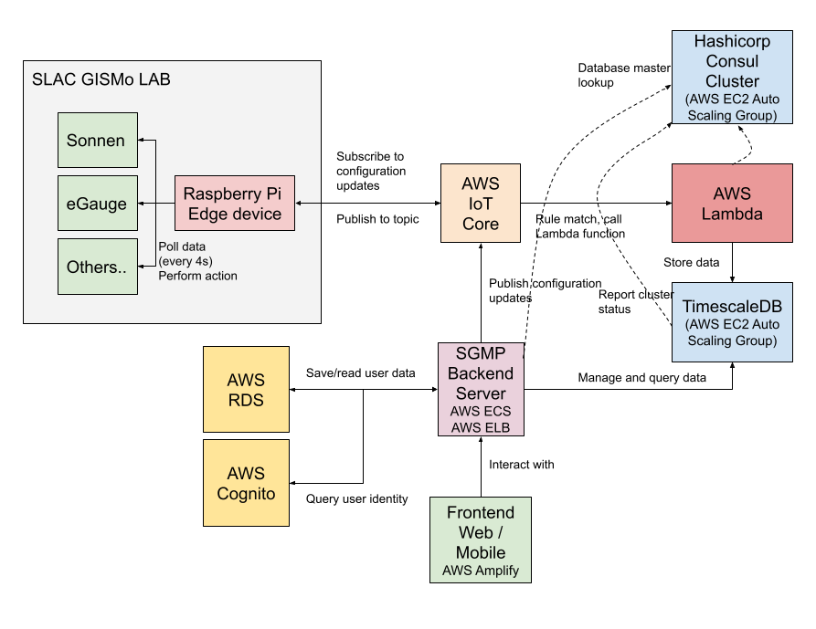
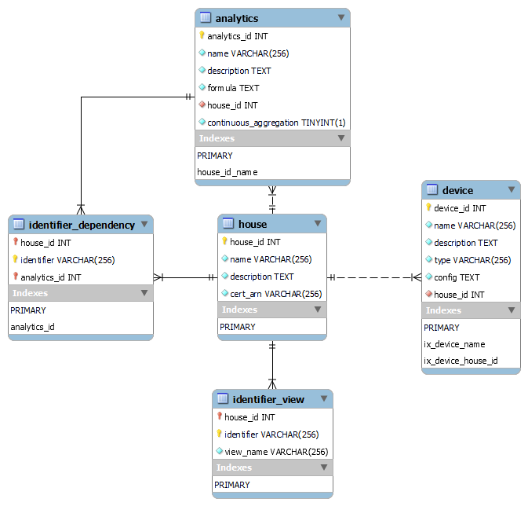

# Technical Document

## Architecture

## Terminology

- Device: a device in the user's house. Each device has a name that is unique in the house, a device type and a configuration. The device type determines how the edge device fetches the data from the actual device. The configuration includes information necessary for connecting to the device, such as device LAN IP address, username and password. Each device can have one or more fields.

- Field: a specific measurement of a device. For example, a battery controller device might have a field for state of charge and a field for charging current.

- Formula: an expression that combines fields from one or more devices into one single output. For example we can add the charging current field of two EV chargers to obtain the total EV charging current. The analytics engine supports evaluation of arithmetic operations as well as some built-in functions. You can find specifications of formulas in operating playbook.

- Analytics: a formula that is stored in the backend database. Each analytic has a unique name within its house. With this level of abstraction we can accommodate for architecture differences across houses. For example, each house can have an analytic item with the name `ev_charge_current` but this translates to different formulas in different houses. The frontend expects a set of analytic items to be present in each house (listed in operating playbook). Apart from storing formulas, when the analytic item is created the server optionally creates a continuous aggregation in the backend time series database which will aggregate the data each hour for fast lookup.

- House: scope of context. Each user can only access the house they are assigned to. Each house will have a set of devices and analytic items.

## Edge Device

Each house has a Raspberry Pi device running our data collection Python application. The application will read the device configuration, connect to AWS IoT Core using MQTT protocol, read data periodically and push them to IoT Core. Each device type is implemented as a class and the class should implement the prototype function for reading data. The main application maintains a mapping between device type and the implementation class. Apart from publishing data, the application subscribes to device configuration updates and writes new configuration to the file as well.

Topic that the device publishes to:
- `gismolab_sgmp_read/gismolab_sgmp_house_[house_id]/[device_id]/[device_name]/[timestamp]/data`
- `gismolab_sgmp_read/gismolab_sgmp_house_[house_id]/[device_id]/[device_name]/[timestamp]/event`

Topic the device subscribes to:
- `gismolab_sgmp_config/gismolab_sgmp_house_[house_id]/devices`

Each device connects to AWS using its own certificate and private key. We have policies set such that each device can only publish and subscribe to their own topics. User should call the API server which will in turn invoke the AWS IoT Core API to generate a set of credentials. Refer to the API specification for how to generate a certificate for a house.

## IoT Core

Each house is represented as a thing. Additionally we use Terraform to define a thing that the backend API server will connect as. The private key for the API server is stored as a secret in AWS Secrets Manager. We define two policies. The first one is for API server certificates that can connect as the backend thing and publish to device configuration topics. The second one is for edge devices that can only connect as the thing that the certificate is associated with and publish to and subscribe from given topics.

We also use Terraform to define a rule that will trigger our Lambda function to store the ingested data into the time series database.

## TimescaleDB & Hashicorp Consul

TimescaleDB is an extension built upon PostgreSQL which is designed to store time series data natively. It splits the data into chunks based on the timestamp so data lookup within a given time range can be much faster. One cool feature about TimescaleDB is continuous aggregation. When we create a continuous aggregation the database will create a job which is triggered periodically, aggregates data in the background and stores the result in a virtual table. In our case, we aggregate the data in hourly average and the job runs once per hour. We create continuous aggregations for the analytic items that have continuous aggregation enabled, and maintain a mapping between the identifier (device name + field name) and the continuous aggregation name in our MySQL metadata store. We also maintain a table that stores the dependency relationships so that when no analytics refer to a continuous aggregation anymore we can tear down that job in our database. For example, if we have the following analytic items with continuous aggregation enabled:
- `battery = egauge.A.Battery`
- `battery_charging = pos(egauge.A.Battery)`
- `battery_discharging = -neg(egauge.A.Battery)`
- `ev = -egauge.A.EV`

Then in TimescaleDB two continuous aggregations will be created, namely on `egauge.A.Battery` and `egauge.A.EV`.

Consul is a high-availability distributed consensus data store and service discovery application. To add high-availability to our TimescaleDB database, we use Patroni which is a wrapper for PostgreSQL. We build custom AMI that has Consul client, PostgreSQL, TimescaleDB and Patroni installed using Hashicorp Packer. We launch the database EC2 instances as an Auto Scaling Group across 2 availability zones.

Patroni uses Consul as its backend to store information about the cluster. Each time we spin up a replica, Patroni will read the master's IP address from Consul and replicate the data from the master. When the master goes down, Patroni will automatically elect a new master. Additionally Patroni will register itself as a service in Consul, and automatically append a tag `master` for the master instance. Consul provides service discovery by acting as a DNS server. Thus, if the Patroni cluster name is `tsdb`, we can query `master.tsdb.service.consul` and the Consul servers will always return the IP of the master server.

We also build a custom AMI that has Consul server installed, and launch the Consul servers as an Auto Scaling Group across 2 AZs. The Consul server instances are tagged, thus Consul agents (server and client) can discover peer servers by querying the EC2 service for the instances that have this special tag. In our data ingest Lambda function and backend API server where we don't run a Consul client, the application queries EC2 service by itself to obtain the IP of Consul servers and then use DNS query to ask for the TimescaleDB master server IP.

The database credentials for TimescaleDB are generated out-of-band (i.e. not in Terraform code) and stored in Secrets Manager.

## Lambda Function

The lambda function stores the incoming IoT Core data into TimescaleDB. It discovers the master TimescaleDB server by performing DNS queries against the Consul server and retrieves the database credentials from Secrets Manager.

## SGMP Backend

The backend API is written in Flask using Python. It is deployed as Docker containers in AWS ECS using Fargate as its backend and is load balanced using AWS Application Load Balancer, allowing flexibility and scalability. It discovers the master TimescaleDB server by performing DNS queries against the Consul server. The database credentials are injected by ECS as environment variables. The IoT private key is retrieved using a sidecar container which queries the Secrets Manager for the private key and stores it in an ephemeral volume that is shared with the main container.

## AWS RDS MySQL

We store metadata such as device configuration, analytic items in a MySQL database which is hosted on AWS RDS. Database schema is as following:

MySQL user password is also generated and stored out-of-band in Secrets Manager. See deploy playbook for more details.

## AWS Cognito

User information is stored on AWS Cognito. When a user logs in, the client sends their credential to SGMP API server which will initiate the login flow against Cognito. Upon successful validation it returns the access and refresh tokens generated by Cognito to the client.